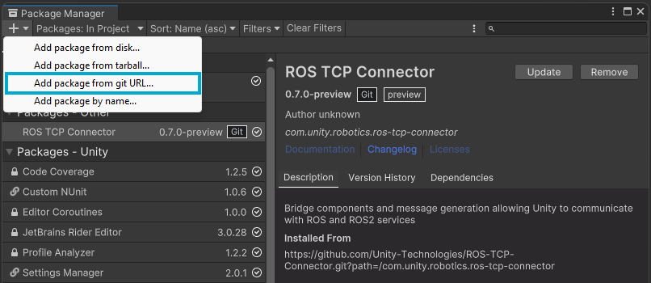
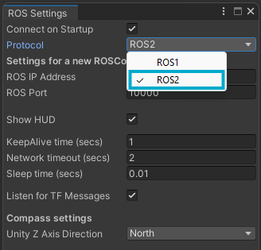
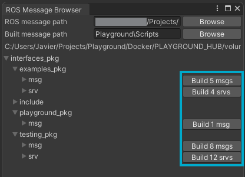

# Playground

[description]

## Table of contents
- [🏠 About]()
- [✨ Features](#features)
- [📋 Prerequisites](#prerequisites)
- [📖 Getting Started](#getting-started)
    - [🔧 Installation](#installation)
        - [Set up the Unity project](#set-up-the-unity-project)
        - [Set up the docker image](#set-up-the-docker-image)
    - [🚀 Deployment](#deployment)
        - [Deploy the Unity environment](#deploy-the-unity-environment)
        - [Deploy the ROS environment](#deploy-the-ros-environment)
- [📁 Project structure](#project-structure)

## About
[about]

## Features
[features]

## Prerequisites


| Software                                        | Tested Version | Download link                                                      |
|-------------------------------------------------|----------------|--------------------------------------------------------------------|
| Unity                                           | -              | [[download link]](https://unity.com/download)                      |
| Docker Desktop                                  | -              | [[download link]](https://www.docker.com/products/docker-desktop/) |
| Windows X Server (for Docker GUI visualization) | -              | [[download link]](https://sourceforge.net/projects/vcxsrv/)        |


## Getting Started

### Installation

#### Set up the Unity project

1. **Create the project**

    1. Inside [Unity Folder](./Unity/), rename the [Playground](./Unity/Playground/) project folder containing the required assets.
    2. Create a new Unity project named "Playground" in the [Unity Folder](./Unity/).
    3. Replace the new Assets folder with [Playground/Assets](./Unity/Playground/Assets/).
    4. Remove the old, renamed folder.

2. **Install external packages**

    1. In the Unity Project, open the Package Manager in `Window > Package Manager`.
    2. Click the `+` sign on the top left corner of the package manager, select `Add package from git URL` and enter `https://github.com/Unity-Technologies/ROS-TCP-Connector.git?path=/com.unity.robotics.ros-tcp-connector` to add the [ROS-TCP-Connector](https://github.com/Unity-Technologies/ROS-TCP-Connector) package.

    
    
    3. In `Robotics > ROS Settings` switch the protocol to `ROS2`.

    

    4. In `Robotics > Generate ROS Messages` check that `ROS message path` is pointing to [interfaces_pkg](./Docker/PLAYGROUND_HUB/volume/ROS/src/interfaces_pkg/) and build the messages and services.

    

#### Set up the docker image

1. Compose the [docker-compose.yml](./Docker/docker-compose.yml) file up by running the following command:
```bash
docker compose -f "Docker\docker-compose.yml" up -d --build
```
2. Attach a terminal to the created `playground_hub`container and change the directory to [/home/ros] by running:
```bash
cd ros
```
3. Build the ROS packages

Run:
```bash
source /opt/ros/humble/setup.bash
colcon build
colcon build --symlink-install
```

In case of errors when building the packages, remove the following generated folders in `/home/ros`:
```
/build
/install
/log
```

and try building the packages independently:
```bash
source /opt/ros/humble/setup.bash
colcon build --packages-select interfaces_pkg
colcon build --symlink-install --packages-ignore interfaces_pkg
```

### Deployment

#### Deploy the Unity environment

1. In Unity, open the scene in [/Playground/Scenes/Testing/LidarSensorTestScene](./Unity/Playground/Assets/Playground/Scenes/Testing/LidarSensorTestScene.unity).
2. Play the scene.

### Deploy the ROS environment
1. Attach two terminals to the `playground_hub`container and change the directory to `/home/ros`.
2. In the first terminal, run the command:
```bash
source /opt/ros/humble/setup.bash && source install/setup.bash && ros2 run ros_tcp_endpoint default_server_endpoint
```
2. In the second terminal, run the command:
```bash
source /opt/ros/humble/setup.bash && source install/setup.bash && ros2 run testing_pkg lidar_sensor_test
```

## Project structure


